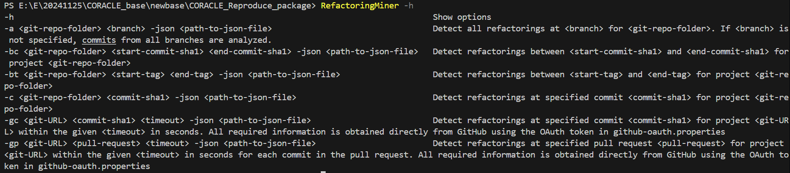

# The replication kit of CORACLE

## Automated label generation for defect data sets: how far are we?

This repository stores the **source codes** and generated data of CORACLE.

### 1. Folders Introduction

- [`CORACLE/`](https://github.com/RYCBE/CORACLE_Reproduce_package/CORACLE/) This folder stores the source code of `CORACLE` written in Python and some initial input files.
  - [`CORACLE/bugFixFiles`](https://github.com/RYCBE/CORACLE_Reproduce_package/CORACLE/bugFixFiles/) This folder stores the bug-fixing commits files downloaded from [Vandehei's work](https://gitlab.com/Bvandehei/affectedversions/-/tree/master/Datasets/RQ2/BugFixFiles).
  - [`CORACLE/v2v`](https://github.com/RYCBE/CORACLE_Reproduce_package/CORACLE/v2v/) This folder stores the version mapping files. There are some formatting differences between the project version names collected in our work and Vandehei's work. This file is used for name mapping between versions.
  - [`CORACLE/VanVersioncsv`](https://github.com/RYCBE/CORACLE_Reproduce_package/CORACLE/v2v/) This folder stores the version information files downloaded from [Vandehei's work](https://gitlab.com/Bvandehei/affectedversions/-/tree/master/Datasets/RQ2/VersionInfo).
- [`RQx/`](https://github.com/RYCBE/CORACLE_Reproduce_package/CORACLE/) RQx folder stores all source code and data of a Research Question.

### 2. Execution commands

#### 2.1 Run CORACLE

- Install Refactoring Miner, reference link: https://github.com/tsantalis/RefactoringMiner  (Thank you again for the great work of Nikolaos Tsantalis and others) . Then add the path where Refactoring Miner program is located to the environment variable to ensure that the command `RefactoringMiner - h` can run normally as follows.

  

- `pip install -r requirements.txt`

- `cd CORACLE`

- `python start.py `

After completing the above steps, the labels generated by CORACLE will be displayed under `./CORACLE/FinalRes/`, each project label is presented in binary form.

